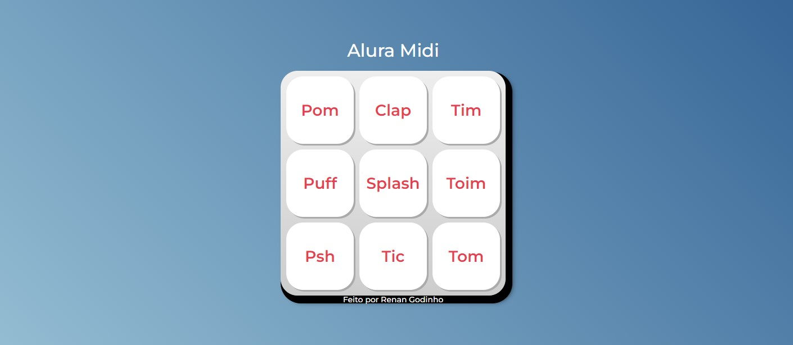

  

# 🖥️ Projeto

  Esse é um projeto Web Responsivo, que ao clicar ou pressionar a tecla Enter ou Space, tocará o som.

## 🚀 Tecnologias

 Esse projeto foi desenvolvido durante os estudos, com as seguintes tecnologias: 
  

  - 
  - 
  - 
  

